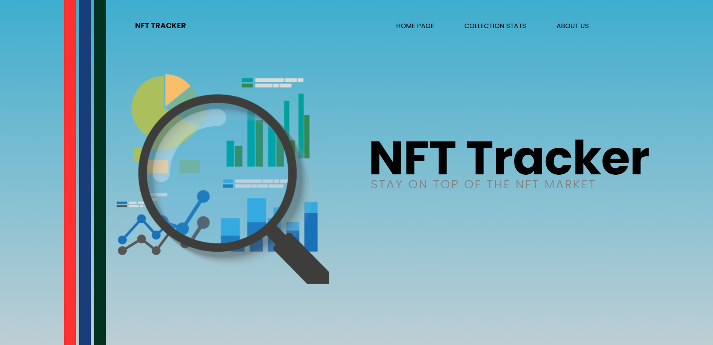
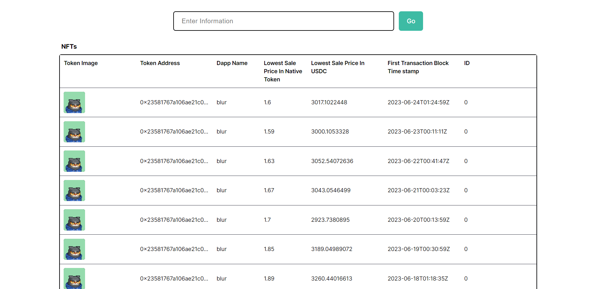

# NFT Tracker
## _Stay on Top of the NFT Market_

## Installation

In the project directory, you can run:
```sh
npm run dev
```
For production environments...
```sh
npm i 
```

## Development

<div align="center">
</div>
</div>

The powerful NFT Tracker Web Application has been created to offer real-time insights and data about Non-Fungible Token (NFT) collections. Through an interface that is easy to use, users can input the token address of any specific collection. They can retrieve important information about that collection instantly.

To gather and display essential collection statistics, the web application uses the AirStack API. The stats account for the dApp name, lowest sale price in native blockchain token, lowest selling price converted to USDC (USD stablecoin), and token address. The initial transaction block's timestamp for the collection is also included.

<div align="center">
</div>
</div>

Furthermore, the app collects comprehensive data regarding the NFTs linked with the collection. Individual NFTs within the collection can be explored by users. One can see their personal token IDs and access content values like images upon logging in. For an attractive and informative experience, the app conveniently showcases small-sized images of the NFTs.

Get a comprehensive overview of your preferred collection with just 20 results limit on the NFT Tracker Web Application. Keeping oneself informed about the latest trends and pricing data in the NFT market is enabled by it for users.

NFT enthusiasts, collectors, and investors can conveniently and efficiently monitor the performance of specific NFT collections using the NFT Tracker Web Application. The capability to make knowledgeable decisions is facilitated by access to real-time data and insights.
